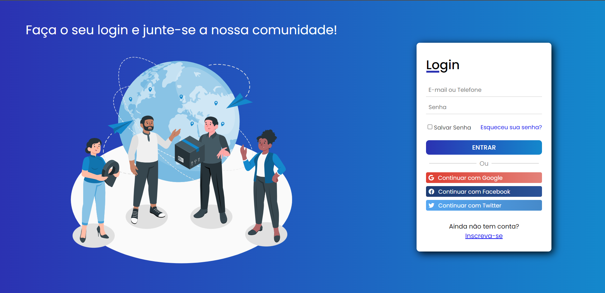
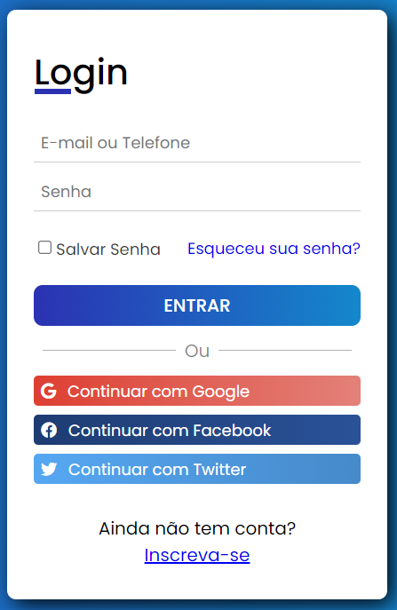
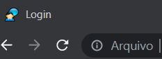

Olá,
 
Esse é o meu primeiro projeto utilizando HTML e CSS com pouco mais de 2 meses de estudos. Consiste inicialmente em uma tela de login que permita o usuário entrar através de outras contas como facebook, gmail ou twitter.
### Não tenho objetivos financeiros e a ideia é apeans exercitar meus conhecimentos adquiridos ao longo dos meus estudos. 
 Meu plano é simular uma rede social e planejo utilizar o Orkut, que foi a primeira rede social que tive contato em 2007, como uma base simulando sua versão nos tempos atuais.

O projeto será evoluido com o tempo aplicando resposividade e interações com JS. A ideia é simular uma rede social e está tela de Login é apenas o inicio de uma grande jornada. 😁

 

<h2>Overview da tela de Login.</h2>

 
<h3>Campo de Login</h3>

 

<h3>Ilustração</h3>

Retirada do site ' https://storyset.com/ ' que fornece ilustrações gratuitas.

 

<h3>Fav icon</h3>
